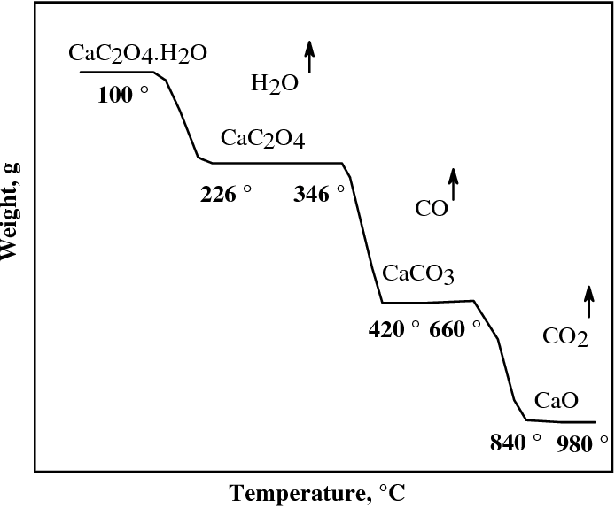

# Instalación de paquetes

Primero cargamos los paquetes `usethis` y `devtools` para descargar los paquetes desde github.

```{r}
library(usethis)
library(devtools)
```

Luego, usando la funcion `install_github()` pasando como argumentos la dirección del repositorio en el cual está el paquete, y `force = TRUE` para evitar problemas durante la instalación.

```{r, eval = FALSE}
install_github('https://github.com/sergmonic/AtomicWeights/',force = TRUE)
install_github('https://github.com/sergmonic/uLPAQ/',force = TRUE)
```

Una vez instalados los paquetes, podemos agregarlos al entorno de trabajo utilizando la función `library()`.

```{r, message=F}
library(AtomicWeights)
library(uLPAQ)
```

Podemos acceder a las páginas de ayuda para cada una de las funciones mediante la función `help()` o `?`

```{r, eval = FALSE}
help(package="AtomicWeights")
help(package="uLPAQ")
```

# Procedimiento para la evaluación y estimación según la  [GUM](https://www.bipm.org/documents/20126/2071204/JCGM_100_2008_E.pdf/cb0ef43f-baa5-11cf-3f85-4dcd86f77bd6)

1. Identificar el mesurando

2. Identificar las fuentes de incertidumbre y la posible existencia de fuentes dominantes.

3. Clasificar las fuentes de incertidumbre en tipo A o tipo B.

4. Expresar la relación matemática entre el mesurando $Y$ y las variables de entrada $X_i$ de las cuales depende:

\begin{align}

Y = f(X_1, X_2, ..., x_n) 
\end{align}


Esta expresión debe contener cada cantidad que puede contribuir a la incertidumbre del resultado de la medición.

5. Estimar las incertidumbres asociadas a cada funte de error (contribuciones). Convertir a incertidumbres estándar.

 

6. Combinar las incertidumbres para obtener la **incertidumbre combinada**.

   Para sumas (siempre y cuando las contribuciones tengan las mismas unidades):
        
     \begin{align}
    y = a + b, y = a - b
    \end{align}
    \begin{align}
    u_y = \sqrt{u^2_a + u^2_b}
    \end{align}
    Para Multiplicaciones: \textit{U combinada relativa}
        
     \begin{align}
    y = ab, y = a/b
    \end{align}
    \begin{align}
    u_y/y = \sqrt{(u_a/a)^2 + (u_b/b)^2}
    \end{align}
    

7. Calcular La **Incertidumbre expandida (U)** utilizando un factor de cubrimiento (k)

\begin{align}
U = ku
\end{align}
 
# Modelo Matemático del mesurando e identificación de fuentes de incertidumbre.


* Mesurando: Concentración molar de NaOH: obtenida mediante titulación volumétrica empleando KHP y con seguimiento potenciométrico.

* Fuentes:

    + Masa de KHP empleada para la estandarización (`m_kHP`) en g
    + Masa molar de KHP (`W_KHP`) en g/mol
    + Volumen gastado de solución de NaOH (`V_NaOH`) en mL
    + Pureza del KHP  (`P_KHP`) de forma fraccional (g/g)
    + Repetibilidad (R) obtenida de X muestras independientes (fraccional/relativa)
  
Para relacionar las fuentes de incertidumbre con la incertidumbre del mesurando, podemos dibujar un diagrama Ishikawa de causa y efecto, o espina de pescado.

Para construir este diagrama en `R`, podemos utilizar la función `cause.and.effect` del paquete `qcc`:


```{r message = F}
library(qcc)
cause.and.effect(cause=list(m_KHP = '(g)',
                            W_KHP = '(g/mol)',
                            V_NaOH = c('material volumetrico', 
                                           'punto final'),
                            P_KHP = '(g/g)',
                             Repetibilidad= ''),
                 effect = 'Incertidumbre NaOH')
```


## Modelo matemático
 
 Para el cálculo de la concentración $C_{NaOH}$ de NaOH de una solución, la cual se valora haciendo reaccionar $m_{KHP}$ g de biftalato de potasio, el cual tiene una pureza de $m_{KHP}$ con un volumen de $V_{NaOH}$ de la solución problema:
 
 \begin{align}
 
 C_{NaOH} = \frac{1000 \; \cdot \; m_{KHP} \; \cdot \; P_{KHP} \; \cdot \ R}{W_{KHP} \; \cdot \; V_{NaOH} }
 \end{align}
 
 
 Podemos crear la función que relaciona la concentración del hidróxido de sodio `C_NaOH` con el factor de conversión, utilizando la función `function()` creando como argumentos cada uno de los parámetros del factor de conversión:
 
```{r}
C_NaOH<-function(m_KHP,
                 W_KHP,
                 V_NaOH,
                 P_KHP,
                 R){
  
  1000*m_KHP*P_KHP*R/(W_KHP*V_NaOH)
}
```
 


# Incertidumbre en masas molares

Fórmula molecular de KHP: $KC_8O_4H_5$

Para determinar la masa molar de un compuesto, y la incertidumbre asociada a esta masa molar, podemos utilizar las funciones `getAtomicWeight` y `getMolarMass`, disponibles en el paquete `AtomicWeights`.

Para revisar más información sobre dichas funciones, podemos revisar las siguientes páginas de ayuda:

```{r, eval=FALSE}
help("getAtomicWeight")
help("getMolarMass")
```

```{r}
W_KHP=getMolarMass(atomsType = c("K", "C", "O", "H"),
                   c(1,8,4,5))
```


# Volumen de NaOH gastado en la valoración

## Incertidumbre en mediciones de volumen

Para las mediciones de volumen en material volumétrico de vidrio, podemos utilizar la función `instVolumetrico`. Para acceder a la página de ayuda de esta función podemos ejecutar el siguiente comando:

```{r, eval =FALSE}
help("instVolumetrico")
```

## Incertidumbre la determinación del punto final de la titulación (volumen de equivalencia)

Para determinar la incertidumbre en la determinación del punto final de la titulación, e.g. en una valoración potenciométrica con electrodo de pH, el punto de inflexión en la curva pH vs volumen de agente titulante, podemos utilizar la función `puntoFinal` del paquete `uLPAQ`. 

Esta función determina el punto final mediante tres algoritmos distintos, y devuelve una lista con tres tablas, o `data.frame`. Cada una correspondiente a un algoritmo de determinación del punto de inflexión:

1. `d1num` contiene el resultado en $x$ (volumen de titulante) determinado como el máximo de la primera derivada numérica hacia [adelante](https://en.wikipedia.org/wiki/Finite_difference)

2. `rLog` contiene el resultado del punto de inflexión empleando el modelo de regresión logística disponible en el paquete [`nplr`](https://cran.r-project.org/web/packages/nplr/vignettes/nplr.pdf)

3. `ede` contiene el punto final de la titulacion estimado mediante el estimador de distancia máxima, disponible en el paquete [`inflection`](https://cran.r-project.org/web/packages/inflection/vignettes/inflection.html)


```{r}
PF=puntoFinal(datosAnalisis$valoracionNaOH$V,
              datosAnalisis$valoracionNaOH$pH,
              intervalo_x = c(10,13))
PF
```


## Incertidumbre por el uso de material volumétrico (bureta de capacidad de 25 mL).

para determinar la incertidumbre por medir el volumen determinado con la función de `puntoFinal` en una bureta, podemos utilizar la función `instVolumetrico`, como se muestra a continuación:

```{r, message = FALSE}
bureta_NaOH <- instVolumetrico(nominal=25,
                            subdivision =0.05 ,
                            tipo="bureta",
                            clase="A_AS",
                            volumen=PF$d1num$PE,
                            temp = 17.5)
```

## obtención de `V_NaOH` considerando material volumétrico y obtención de PF

Una vez tenemos el aporte a la incertidumbre por las dos fuentes para el volumen de titulante gastado en la valoración:

* Incertidumbre asociada a la determinación del punto final, contenida en  `PF$d1num$u_PE`

* Incertidumbre asociada a el uso de material volumetrico contenida en `bureta_NaOH$u_V`.

Ahora podemos calcular la incertidumbre asociada al volumen como incertidumbre combinada de las dos fuentes principales, punto final y medición en bureta.

\begin{align}
u_{V_{NaOH}} = \sqrt{u_{PF}^2 + u_{bureta}^2}
\end{align}

```{r}
.V_NaOH=PF$d1num$PE
.u_V_NaOH=sqrt(PF$d1num$u_PE^2+bureta_NaOH$u_V^2)
V_NaOH=data.frame(V_NaOH=.V_NaOH,
                  u_V_NaOH=.u_V_NaOH)
V_NaOH
```


### Ejemplos con otros tipos de material volumétrico

Si se llega a dar el caso en el que en el procedimiento experimental se utilizan otros tipos de material de vidrio para realizar mediciones de volumen, podemos utilizar la función  `instVolumetrico`. A continuación algunos ejemplos.


```{r}
balon100 <- instVolumetrico(nominal=100,
                         tipo="balon",
                         clase="A",
                         temp=16)
```

```{r}
pipeta10 <- instVolumetrico(nominal=10,
                         tipo="pipeta",
                         clase="A_AS",
                         temp=16)
```

```{r}
micropipeta <- instVolumetrico(nominal=1,
                            tipo="micropipeta",
                            volumen=1,
                            temp=16)
```


# Incertidumbre en medición de masa de KHP: mediciones gravimétricas

Dentro del paquete `uLPAQ` tenemos disponibles las funciones `u_masa` y `masa_minima` relacionadas con el uso de balanzas analíticas. 

* `masa_minima` nos sirve para determinar cual es la mínima cantidad de masa que podemos pesar en una balanza con determinadas propiedades para cumplir con la condición de un valor máximo de incertidumbre relativa. 

* `u_masa` nos sirve para determinar la incertidumbre asociada a medir la masa de un sólido que tiene una densidad asociada, y usando una balanza analítica con propiedades determinadas.

Las balanzas que se pueden utilizar en este paquete, se encuentran en la tabla `balanzasLPAQ` dentro del paquete `uLPAQ`:

```{r echo = F}
data("balanzasLPAQ")
knitr::kable(balanzasLPAQ, align = 'c')

```
En donde:

* $Capacidad\;Máxima$ es la masa máxima que se puede pesar en la balanza, reportada por el fabricante
* $Legibilidad$ es la mínima división de escala, $d$, reportada por el fabricante.
*  $Repetibilidad$ Asociada con la dispersión de mediciones repetidas de masas patrón, expresada por el fabricante o determinada en una calibración.
* La $desviación \; de\;la \;linealidad \;$ nos da información sobre que tanto varía la relación lineal entre la masa nominal y la lectura de la balanza.

*  $la \;deriva \;en \;la \;sensibilidad \;por\; la\; deriva\; termica$ nos habla de como cambia la pendiente de la relación masa nominal $\rightarrow$ lectura, por un cambio en la temperatura. 

* la $Tolerancia\; en \;la \;Sensibilidad$ expresa un intervalo dentro del cual pueden estar los valores de la sensibilidad, con una probabilidad dada.

A partir de estas propiedades, es que las funciones `masa_minima` y `u_masa` pueden calcular masas en funcion de incertidumbres relativas, e incertidumbres y masas corregidas.

Para saber más información sobre `masa_minima`:
```{r, eval = F}
help(masa_minima)
```

Por ejemplo, podemos calcular la cantidad de masa mínima de biftalato de potasio, con una densidad de $1636 \frac{Kg}{m^3}$, para cumplir con un máximo de incertidumbre relativa para la medición de masa $0.1\;g$:

```{r, results='hide',fig.keep='all'}
masa_minima(u_r = 0.1,densidad = 1636,balanza = "ME204")
```

A continuación, calculamos la incertidumbre asociada a la medición de `0.1026\;g` en la balanza `ME204`, de un sólido  con densidad de $1636 \frac{Kg}{m^3}$ (biftalato de potasio):

```{r}
m_KHP=u_masa(lectura = 0.1026,
             densidad = 1636,
             balanza = "ME204")

```

La función `u_masa` nos devuelve una lista de tablas, teniendo en la primera posición de esta lista, un `data.frame` con dos columnas, en la primera columna la masa corregida por el efecto de flotación, y en la segunda columna la incertidumbre asociada a la medición de esta masa, en esta balanza. 

```{r}
str(m_KHP)
```


# Incertidumbre en la pureza del biftalato

La función `pureza` devuelve estimados de puereza en incertidumbre basados en especificaciones técnicas del reactivo. Debemos especificar los valores como fracciones de masa, en el intervalo  $0 \leq pureza \leq 1$.

```{r, eval = FALSE}
help("pureza")
```


```{r}
P_KHP = pureza(0.999)
P_KHP
```

# Incertidumbre por repetibilidad

Para realizar el cálculo de la concentración de la solución de hidróxido de sodio, sin ser afectado por el valor de la repetibilidad, definimos la repetibilidad como `R =1`.

Dado que en el experimento de este ejercicio solo se realizó una determinación, sin réplicas, la incertidumbre asociada a la repetiblidad se define como `u_R=0`.

En el caso en el que se tengan réplicas, podemos reportar la incertidumbre asociada a la repetiblidad tal como se reporta en la [literatura](https://revistas.unal.edu.co/index.php/rcolquim/article/view/72401/70042):

\begin{align}

u_R = \frac{s}{\sqrt{n}}

\end{align}

en donde $s$ es la desviación estándar de las réplicas, (el resultado de concentración) y $n$ es el número de réplicas. 


```{r}
R=1
u_R=0.0
```

# Estimación de la incertidumbre combinada

Una vez hemos determinado todas las fuentes de incertidumbre y estimado las incertidumbres asociadas a dichas mediciones podemos estimarlas de la siquiente manera:

* de forma general

\begin{align}

u^2_c (y) = \sum_{i=1}^N \left(\frac{\delta f}{\delta x_i}\right)^2 \cdot u^2(x_i)

\end{align}

\begin{align}

u_c (y) = \left( \sum_{i=1}^N \left(\frac{\delta f}{\delta x_i}\right)^2 \cdot u^2(x_i) \right)^\frac{1}{2}

\end{align}


\begin{align}

u_c (y) = \sqrt{ \sum_{i=1}^N \left(\frac{\delta f}{\delta x_i}\right)^2 \cdot u^2(x_i) }

\end{align}

En donde $\left(\frac{\delta f}{\delta x_i}\right)$ es el coeficiente de sensiblidad de $f$ respecto a $x_i$.

* En este caso

\begin{align}
y = f(x_1, x_2, x_3,...,x_n) = C_{NaOH} (m_{KHP}, P_{KHP}, R, W_{KHP}, V_{NaOH})
\end{align}

\begin{align}
u^2_c (C_{NaOH}) = \sum_{i=1}^5 \left(\frac{\delta f}{\delta x_i}\right)^2 \cdot u^2(x_i)
\end{align}

## Creación de una función que estima los coeficientes de sensibilidad para una función de `R` que contiene el modelo matemático

Para encontrar como cambia la concentración de hidróxido de sodio, como respuesta a los cambios en cada una de las variables de infuencia: `m_KHP`,`W_KHP`,`V_NaOH`,`P_KHP`y`R`
Podemos utilizar la función `Deriv` del paquete con el mismo nombre, pasando como primer argumento la función que contiene el modelo matemático en `R`, `C_NaOH`, y como segundo argumento un vector de caracteres, que contiene los nombres de las variables con respecto a las cuales la función `C_NaOH` debe ser diferenciada.

```{r}
library(Deriv)
c_i=Deriv(C_NaOH,
          c("m_KHP","W_KHP","V_NaOH","P_KHP","R"))

```

al imprimir el contenido de la funcion `c_i` vemos una descripcion de los pasos que se toman para calcular las derivadas de la función con una información de entrada determinada (los valores que toman las variables `m_KHP`,`W_KHP`,`V_NaOH`,`P_KHP`y`R`)

```{r}
c_i 
```


### Valores de los coeficientes de sensibilidad, obtenido a partir de los valores de la variables de influencia

Al tener lista la función `c_i`, podemos darle los valores de las variables de influencia para este experimento, dado que ya las definimos dentro de `R`, e incluso corregimos algunas como la pureza y la masa del biftalato en pasos anteriores. En este caso `c_i` a partir de los valores definidos calculará la magnitud de cada uno de los coeficientes de sensibilidad y lo guardará en cada posición del vector `v_c_i`:

```{r}
v_c_i <- c_i(m_KHP$m_s$ms,W_KHP$MM,V_NaOH$V_NaOH,P_KHP$P,R)
v_c_i
```


### vector recogiendo las incertdumbres estándar de la diferentes fuentes

Ya tenemos calculadas las incertidumbres de cada fuente, pero éstas están guardadas en cada objeto que creamos en los pasos anteriores, para juntarlas, podemos llamarlas por su nombre y guardarlas en un vector `u_i` en el mismo orden en el que están en el vector `v_c_i`. 
```{r}
u_i=c(m_KHP$m_s$u_ms,W_KHP$u_MM,V_NaOH$u_V_NaOH,P_KHP$u_P,u_R)
u_i
```
# Incertidumbre combinada

Una vez tenemos los valores de los coeficientes de sensiblidad, y de las incertidumbres, podemos combinarlas utilizando la ecuación:

\begin{equation}


u_c (C_{NaOH}) = \sqrt{\left( \frac{\delta C_{NaOH}}{\delta m_{KHP}}\right)^2 \cdot u^2(m_{KHP}) +
\left( \frac{\delta C_{NaOH}}{\delta P_{KHP}}\right)^2 \cdot u^2( P_{KHP}) +

\left( \frac{\delta C_{NaOH}}{\delta  R}\right)^2 \cdot u^2( R) + \\ 

\left( \frac{\delta C_{NaOH}}{\delta  W_{KHP}}\right)^2 \cdot u^2(W_{KHP}) +

\left( \frac{\delta C_{NaOH}}{\delta  V_{NaOH}}\right)^2 \cdot u^2(V_{NaOH})


}


\end{equation}
 

```{r}
u_c=sqrt(sum((v_c_i*u_i)^2))
u_c
```


# Obtención de incertidumbre expandida

Una medida adicional de incertidumbre que cumple con el requerimiento de proporcionar un intervalo con nuestro resultado (para reportar la concentración) es la *incertidumbre expandida* , denotada como $U$. Ésta se obtiene al multiplicar la incertidumbre combinada, $u_c(C_{NaOH})$ por un factor de  $k$:

\begin{align}
U = k \cdot u_c(C_{NaOH})
\end{align}


```{r}
k=2 # Se expande asumiendo una distribución normal, para una probabilidad de confianza del 95 %
U=k*u_c
U # Incertidumbre expandida
```

# Contribuciones de cada fuente

Una vez tenemos la incertidumbre combinada y el valor de cada una de las fuentes de incertidumbre, podemos calcular la fracción relativa de cada una de las fuentes:


\begin{align}
contribución \;(x_i) = \frac{\left( \frac{\delta C_{NaOH}}{\delta x_i}\right)^2 \cdot u(x_i)^2}{u_c(C_{NaOH})}
\end{align}

```{r}
contribuciones=(v_c_i*u_i)^2/u_c^2
pie(contribuciones,main="Contribuciones de fuentes de incertidumbre")
barplot(contribuciones*100,
        xlab="Fuentes de incertidumbre",
        ylab="Aporte a incertudumbre combinada (%)", 
        main="Contribuciones de fuentes de incertidumbre")
```

# Valor del mensurando

Una vez hemos determinado la incertidumbre expandida, podemos reportar el valor de concentración utilizando la función `c_NaOH` que contiene el modelo matemático que relaciona la concentración de la solución, con las variables de influencia `m_KHP`,`W_KHP`,`V_NaOH`,`P_KHP`y`R`.

```{r}
.C_NaOH=C_NaOH(m_KHP$m_s$ms,W_KHP$MM,V_NaOH$V_NaOH,P_KHP$P,R)
```

```{r}
mensurando_C_NaOH=round(data.frame(C_NaOH=.C_NaOH,U_C_NaOH=U),5)
mensurando_C_NaOH
```


# Ejemplo con datos reales


Para este ejemplo se utilizaran los datos resultantes de valoraciones repetidas de una muestra de cascara de huevo. Para determinar el porcentaje de carbonato de calcio $(CaCO_3)$ se determinó el contenido de calcio por gravimetría y por volumetría. En total, 20 grupos de laboratorio determinaron el contenido de calcio, mediante distintas metodologias de la siguiente manera:


* los grupos del 1 al 10 tomaron 100 mg de la muestra en la balanza `ME204`
* los grupos del 11 al 20 grupos tomaron 200 mg de la muestra en la balanza `AES220`

Cada muestra se llevó a volumen en balones tipo A de 50mL.

Luego de esto, se tomaron alicuotas de la siguiente manera:

* Todos los grupos tomaron alicuota de 10 mL en una pipeta tipo A.

<!-- * De los grupos 6 al 10 tomaron una alicuota de 10 mL (pipeta tipo A) -->

<!-- * De los grupos 11 al 15 tomaron alicuota de 10 g en la balanza `ME204` -->
<!-- * De los grupos 16 al 20 tomaron una alicuota de 10 mL (pipeta tipo B). -->

Luego se llevó a cabo la valoración de cada una de las alícuotas de la siguiente manera:

* Las muestras 1 a 10 se llevaron a pH 10 y se titularon con EDTA 0.100 $\pm$ 0.001 M (k=2) en una bureta de 25 $\pm$ 0.05 mL tipo A

* Las muestras 11 a 20 precipitaron con oxalato de amonio, filtraron, secaron, calcinaron a 1000 ºC y se pesaron en la balanza `ME204`.

Un resumen de las variables de procedimiento y los resultados experimentales se encuentran en la siguiente tabla: 

```{r echo = F}
masa.inicial <- c(rep(0.500,10),
                  rep(2.500,10)
                  )
balanza.inicial <- c(rep('ME204',10),
                     rep('AES220',10)
                     )
alicuota <- rep(10, 
                20
                )
clase.pipeta <- rep('A'
                    ,20)
capacidad.bureta <- c(rep(25,10),
                      rep(NA,10))
balanza.calcinacion <- c(rep(NA,10),
                         rep('ME204',10))

set.seed(1234)

library(AtomicWeights)

W_CaCO3 = getMolarMass(atomsType = c('Ca','C','O'),
                       c(1,1,3)
                       )

vol.EDTA <- c(round(
                    rnorm(10,
                          (masa.inicial[1]*93.6*1000*10)/(100*W_CaCO3$MM*0.1*50),
                          0.5),
                    2), 
              
              rep(NA,10))

W_CaO = getMolarMass(atomsType = c('Ca','O'),
                       c(1,1)
                       )
masa.calcin <- c(rep(NA,10),
                 round( rnorm(10,
                             (masa.inicial[11]*93.6*10*W_CaO$MM)/(100*100.09*50),
                              0.001),4)
                 )

df1 <- data.frame(masa.inicial = masa.inicial, balanza.inicial = balanza.inicial, alicuota= alicuota, clase.pipeta = clase.pipeta, capacidad.bureta = capacidad.bureta, balanza.calcinacion = balanza.calcinacion,
                 vol.EDTA = vol.EDTA, masa.calcin=masa.calcin)

colnames(df1) <- c('Masa muestra (g)','balanza inicial', 'Alícuota (mL)', 'Clase pipeta alícuota', 'Capacidad de la bureta (mL)', 'balanza final', 'Volumen EDTA (mL)', 'Masa final (g)')

df3 <- rbind(df1,df1,df1)
df3$replica <- c(rep(1,20),rep(2,20),rep(3,20))
df3$`Volumen EDTA (mL)`[21:30] <-df3$`Volumen EDTA (mL)`[1:10] + rnorm(10, sd = 0.15)
df3$`Volumen EDTA (mL)`[41:50] <-df3$`Volumen EDTA (mL)`[1:10] + rnorm(10, sd = 0.15)
df3$`Volumen EDTA (mL)` <- round(df3$`Volumen EDTA (mL)`,2)

df3$`Volumen EDTA (mL)`[2:10] <- df3$`Volumen EDTA (mL)`[2:10] + 0.1
df3$`Masa final (g)`[31:40] <-df3$`Masa final (g)`[11:20] + rnorm(10, sd = 0.001)
df3$`Masa final (g)`[51:60] <-df3$`Masa final (g)`[11:20] + rnorm(10, sd = 0.001)
df3$`Masa final (g)` <- round(df3$`Masa final (g)`,4)

df3$`Masa final (g)`[c(12,32,52)] <- df3$`Masa final (g)`[c(12,32,52)] - 0.1


knitr::kable(df3)
write.csv(df3, 'tablaEjemplo.csv', row.names = F)
```

Podemos importar esta tabla de datos, disponible en este [enlace](https://github.com/pipoelpipas/Statistics-in-R-2/raw/main/CLT-incertidumbre-clase/tablaEjemplo.csv):

```{r, message = F}
library(downloader)
url1 <- 'https://github.com/pipoelpipas/Statistics-in-R-2/raw/main/CLT-incertidumbre-clase/tablaEjemplo.csv'
download(url1, destfile = 'tablaEjemplo.csv')
datos <- read.csv('tablaEjemplo.csv', sep = ',', header = T)
```

 Una vez tenemos cargados los datos, podemos dividirlos en grupos mas pequeños, por ejemplo un grupo de volumetría y otro de gravimetría:
 
```{r message = F}
library(dplyr)
gravimetria <- filter(datos, balanza.final == 'ME204')
volumetria <- filter(datos, Capacidad.de.la.bureta..mL. == 25)
```
 
 
## Analisis exploratorio
 
 Podemos realizar análisis exploratorio de datos, tal como se ha revisado en el curso a cada uno de los grupos de experimentos, antes de proceder a calcular el contenido de carbonato de calcio en la cáscara de huevo.
 
```{r}
masas <- unlist(select(gravimetria, Masa.final..g.))
volumenes <- unlist(select(volumetria, Volumen.EDTA..mL.))
par(mfrow = c(2,2))
boxplot(masas, main = 'boxplot de masas')
hist(masas)
boxplot(volumenes, main = 'boxplot de volumenes')
hist(volumenes)
```

En este análisis gráfico exploratorio, podemos ver que la distribución de las masas para las titulaciones gravimétricas de aleja de la normalidad debido a datos atípicos, podemos preguntarle a R cuales son, primero calculando el valor crítico inferior:

```{r}
summary(masas)
cuartiles <- quantile(masas)
cuartiles
IQR <- cuartiles[4]-cuartiles[2]
critico.inferior<- cuartiles[2]-(1.5*IQR)
which(masas < critico.inferior)
```
Ahora sabemos que las masas del grupo 12 (el segundo de gravimetría) son datos atípicos, así que podemos rechazarlos. para extraer de nuestro set de datos estos resultados podemos usar el siguiente código:

```{r}
gravimetria <- gravimetria[-c(2,12,22),]

```

Ahora podemos volver a evaluar las distribuciones empíricas de los experimentos:

```{r}
masas <- unlist(select(gravimetria, Masa.final..g.))
par(mfrow = c(2,2))
boxplot(masas, main = 'boxplot de masas')
hist(masas)
boxplot(volumenes, main = 'boxplot de volumenes')
hist(volumenes)
```
Ahora podemos ver que no hay datos atípicos sesgando la distribución de los resultados experimentales.

## Calculo de los promedios y las desviaciones estándar{#custom}

Una vez realizamos este análisis exploratorio, podemos proceder a calcular los promedios de las réplicas y sus respectivas desviaciones estándar (Éstas serán útiles para la incertidumbre dada por repetibilidad para cada experimento)

* Para las volumetrias:

```{r}
volumenes1 <- filter(volumetria, replica ==1) %>% select(Volumen.EDTA..mL.)%>% unlist()
volumenes2 <- filter(volumetria, replica ==2) %>% select(Volumen.EDTA..mL.)%>% unlist()
volumenes3 <- filter(volumetria, replica ==3) %>% select(Volumen.EDTA..mL.)%>% unlist()

volumenes.promedio <- (volumenes1+volumenes2+volumenes3)/3
sd.volumen <- vector('numeric',10)
for(i in 1:10){
  
  sd.volumen[i] <- sd(c(volumenes1[i],volumenes2[i],volumenes3[i]))
}
volumenes.promedio <- as.data.frame(volumenes.promedio)
# sd.volumen
# volumenes.promedio$sd.replicas <- sd.volumen
```

* Para las gravimetrías:

```{r}
 masas1 <- filter(gravimetria, replica ==1) %>% select(Masa.final..g.)%>% unlist()
 masas2 <- filter(gravimetria, replica ==2) %>% select(Masa.final..g.)%>% unlist()
 masas3 <- filter(gravimetria, replica ==3) %>% select(Masa.final..g.)%>% unlist()

masas.promedio.CaO <- (masas1+masas2+masas3)/3
sd.masa <- vector('numeric',9)
for(i in 1:9){
  
  sd.masa[i] <- sd(c(masas1[i],masas2[i],masas3[i]))
}
sd.masa


```


Una vez tenemos separados nuestros datos, podemos proceder a estimar la incertidumbre teniendo encuenta los pasos recomendados por la [GUM](https://www.bipm.org/documents/20126/2071204/JCGM_100_2008_E.pdf/cb0ef43f-baa5-11cf-3f85-4dcd86f77bd6)


## Volumetría 

### Modelo Matemático del  mesurando e identificación de fuentes de incertidumbre

Para el caso de la volumetria, podemos expresar el modelo de la siguiente forma:

 \begin{align}
 
\%CaCO_3 = \frac{0.1 \;\cdot\; FD_{muestra} \;\cdot\; V_{EDTA}\;\cdot\; W_{CaCO_3}\;\cdot\;C_{EDTA} \;\cdot\;R}{m_{muestra}} 

 \end{align}
 
 Podemos entonces crear esta función en `R`:
 
 
```{r}
CaCO3_p.p <- function(FD,
                      V_EDTA,
                      W_CaCO3,
                      C_EDTA,
                      R,
                      m_muestra){
  
  (0.1*FD*V_EDTA*W_CaCO3*C_EDTA*R)/(m_muestra)
  
                      }

```
 

 
```{r, echo = F, eval = T, message = F}
library(qcc)
cause.and.effect(cause=list(FD_muestra = c('balon 50 mL','pipeta 10 mL'),
                            W_CaCO3 = '(g/mol)',
                            V_EDTA = c('material volumetrico', 'punto final'),
                            m_muestra = 'balanza (g)',
                             Repetibilidad= '1',
                            C_EDTA = 'mol/L'),
                 effect = expression(paste(' % CaCO3')))
```
En donde:

* $FD\_{muestra}:$ es el factor de dilución correspondiente a la toma de la alícuota con una pipeta de 10 mL a partir de un volumen de aforo de 50 mL en un balón volumétrico.
* $W\_CaCO_3:$ Es la masa molar del carbonato de calcio
* $V\_EDTA:$ es el volumen de EDTA gastado en la titulación, utilizando un material volumétrico (bureta) y un método para determinar el punto final (indicador, o mediante una curva potenciométrica)

* $C_{EDTA}:$ La concentración de la solución de EDTA valorada con una incertidumbre expandida de 0.001 M (k = 2)
* $m\_muestra:$ es la masa inicial de la muestra, medida en una balanza específica.
* $Repetibilidad:$ La repetibilidad de los experimentos expresada como la desviación de las réplicas, con un valor de 1 y un aporte a la incertidumbre de $U_R = \dfrac{s}{\sqrt{n}}$.


### Incertidumbre por masa molar de $CaCO_3$


Para determinar la incertidumbre asociada a la masa molar de carbonato de calcio, podemos utilizar de nuevo la función `getMolarMass` del paquete `AtomicWeights`.


```{r}
library(AtomicWeights)
W_CaCO3 <- getMolarMass(atomsType = c('Ca','C','O'),
                       c(1,1,3)
                       )
W_CaCO3
```
### Volumen de EDTA gastado en la valoración.

### Incertidumbre en la medición del punto final

En este caso, tenemos dos variaciones, en el laboratorio solo había un electrodo de ion selectivo para calcio, entonces solo el primer grupo pudo hacer la determinación mediante titulación potenciométrica por triplicado.

El resto de grupos, realizaron la determinación del punto final mediante indicador, como se muestra en la siguiente imagen:


Entonces, podemos:

* Determinar los puntos finales con su respectiva incertidumbre para las replicas del primer grupo.
* Dados los puntos finales de los resultados de potenciometría, calcular la incertidumbre dada por la bureta.

* Una vez tengamos estos valores, podemos hallar las incertidumbres de los puntos determinados con indicador, tal como se ha reportado en [literatura.](https://revistas.unal.edu.co/index.php/rcolquim/article/view/72401/70042) 


```{r, echo = FALSE, fig.show='hide'}
library(titrationCurves)


curva1 <- metal_edta(conc.metal = df3$`Volumen EDTA (mL)`[1]*0.1/50,eqpt = TRUE)
curva2 <- metal_edta(conc.metal = df3$`Volumen EDTA (mL)`[21]*0.1/50,eqpt = TRUE)
curva3 <- metal_edta(conc.metal = df3$`Volumen EDTA (mL)`[41]*0.1/50,eqpt = TRUE)
curva3 <- curva3[-c(661),]
curvas <- cbind(curva1,curva2,curva3)
colnames(curvas) <- c('Volumen de EDTA (mL) 1', 'pCa-1','Volumen de EDTA (mL) 2', 'pCa-2','Volumen de EDTA (mL) 3','pCa-3')
write.csv(curvas, 'curvasEDTA.csv', row.names = F)

```

Para ilustrar de nuevo el caso de la determinación de la incertidumbre en el punto final de la titulación, podemos cargar los datos contenidos en el archivo `curvasEDTA.csv` disponible en este [link](https://raw.githubusercontent.com/pipoelpipas/Statistics-in-R-2/main/CLT-incertidumbre-clase/curvasEDTA.csv) 

Primero cargamos los datos a R:

```{r, message = F}
library(downloader)
url2 <- 'https://github.com/pipoelpipas/Statistics-in-R-2/raw/main/CLT-incertidumbre-clase/curvasEDTA.csv'
download(url2, destfile = 'curvasEDTA.csv')
curvasEDTA  <- read.csv('curvasEDTA.csv', sep = ',', header = TRUE)
```

Podemos graficar las curvas de titulación:

```{r}
 plot(curvasEDTA[,1],
     curvasEDTA[,2],
     type = 'l',
     xlab = 'Volumen de EDTA (mL)',
     ylab = 'pCa',
     xlim = c(5,10),
     col = 1,
     ylim = c(1,9)
) 
par(new =T)
 plot(curvasEDTA[,3],
     curvasEDTA[,4],
     type = 'l',
     xlab = '',
     ylab = '',
     xlim = c(5,10),
     col = 2,
     ylim = c(1,9)
     
) 
par(new =T)
  plot(curvasEDTA[,5],
     curvasEDTA[,6],
     type = 'l',
     xlab = '',
     ylab = '',
     xlim = c(5,10),
     col = 3,
     ylim = c(1,9)
  )

```


Luego, podemos utilizar la función `puntoFinal` del paquete `uLPAQ` para estimar la incertidumbre por la determinación del punto final a partir de esta curva:


```{r,results='hide' ,message = F, warning=FALSE}
  library(uLPAQ)
puntos.finales <- list(3)
par(mfrow=c(1,3))
for(i in c(1,3,5)){
  puntos.finales[i] <- puntoFinal(curvasEDTA[,i],curvasEDTA[,i+1])
  
}
puntos.finales
```


Una vez tenemos el volumen dado por la potenciometría, podemos promediar los resultados, y estimar la incertidumbre de este promedio:

```{r}
volumenes.promedio$volumenes.promedio[1] <- mean(puntos.finales[[1]]$PE,puntos.finales[[3]]$PE,puntos.finales[[5]]$PE)


volumenes.promedio <- as.data.frame(volumenes.promedio)
volumenes.promedio$U.PF.Class[1] <- sqrt(puntos.finales[[1]]$u_PE^2+puntos.finales[[3]]$u_PE^2+puntos.finales[[5]]$u_PE^2)

```

Para determinar las incertidumbres de las determinaciones mediante uso del indicador, se pueden utilizar dos procedimientos:

1. El procedimiento clásico, el cual se utiliza cuando **No hay un valor de referencia** mediante el cual se determina la incertidumbre en la determinación del punto final mediante:

\begin{align}
u_{Qpf} = \frac{R}{2\sqrt{3}}
\end{align}

En donde $U_{Qpf}$ es la incertidumbre en el punto final y $R$ corresponde a la resolución del istrumento volumétrico. En la [literatura](https://revistas.unal.edu.co/index.php/rcolquim/article/view/72401/70042) se encuentra reportado que este procedimiento no aplica para todos los casos y solo aplica si el error sistematico es igual a la resolución del instrumento.

2. El procedimiento mediante el cual se hace uso de un **valor de referencia**

\begin{align}

u_{Qpf} = \frac{D}{\sqrt{3}}
\end{align}

Donde D corresponde a la estimación del error sistemático debido al sistema de detección, y **no** al instrumento de medición del agente titulante.

Entonces, para los últimos 9 grupos, podemos determinar la incertidumbre de las dos maneras, ya que tenemos un valor de referencia con las curvas de potenciometría.

```{r}
volumenes.promedio$U.PF.Class[2:10] <- 0.05/2*sqrt(3)
```

A su vez podemos calcular las incertidumbres con el método de referencia:

```{r}
volumenes.promedio$U.PF.Ref[1] <- volumenes.promedio$U.PF.Class[1]
volumenes.promedio$U.PF.Ref[2:10] <- abs(volumenes.promedio$volumenes.promedio[1]-volumenes.promedio$volumenes.promedio[2:10])/sqrt(3)
par(mfrow=c(1,2))
barplot(volumenes.promedio$U.PF.Class, ylim = c(0,0.4))
barplot(volumenes.promedio$U.PF.Ref,  ylim = c(0,0.4))
```


#### Incertidumbre por el uso de material volumétrico (bureta de capacidad de 25mL)

```{r}
 library(uLPAQ)
U_buretas <- vector('list',10)

for(i in 1:10){
  

U_buretas[[i]] <- instVolumetrico(nominal=25,
                            subdivision =0.05 ,
                            tipo="bureta",
                            clase="A_AS",
                            volumen=volumenes.promedio$volumenes.promedio[i],
                            temp = 17.5)$u_V
}
U_buretas <- unlist(U_buretas)
for(i in 1:10){
  
  volumenes.promedio$u_bureta[i] <- as.numeric(U_buretas[i])
  
}

volumenes.promedio$u_bureta <- U_buretas

```


# Incertidumbre en el volumen de agente titulante: EDTA teniendo en cuenta la determinación del punto final y el uso de material volumétrico:

Una vez tenemos las incertidumbres para todos los grupos, podemos calcular la incertidumbre combinada para la determinación del volumen de titulante:

```{r}
u_V_EDTA <- vector('numeric',10)

  
  u_V_EDTA <- sqrt(volumenes.promedio$U.PF.Ref^2+volumenes.promedio$u_bureta^2) 

  volumenes.promedio$u_V_EDTA <- u_V_EDTA
  
par(mfrow = c(1,3))
barplot(volumenes.promedio$U.PF.Ref, main = 'u punto final' , ylim = c(0,0.5))
barplot(volumenes.promedio$u_bureta, main = 'u bureta', ylim = c(0,0.5))
barplot(volumenes.promedio$u_V_EDTA, main = 'u volumen EDTA' , ylim = c(0,0.5))
```


# Incertidumbre en mediciones de masa: masa inicial de muestra de cáscara de huevo.

Ya que todos los grupos tuvieron la destreza de pesar 0.500 g, podemos calcular la incertidumbre dada por la pesada de esta muestra de la siguiente manera:

* Para este experimento se determino la densidad de la cáscara de huevo como: $1085 \dfrac{kg}{m^3}$


```{r}
masas.corregidas <- vector('numeric',10)
u_masas <- vector('numeric',10)

for(i in 1:10){
  
  masas.corregidas[i] <-  u_masa(lectura=0.500,
      densidad = 1085,
      balanza = "ME204")$m_s$ms
}

for(i in 1:10){
  
  u_masas[i] <-  u_masa(lectura=0.500,
      densidad = 1085,
      balanza = "ME204")$m_s$u_ms
}

# u_masas[1:10] <-  u_masa(lectura=0.500,
#       densidad = 1085,
#       balanza = "ME204")$m_s$u_ms

volumenes.promedio$masas_corregidas <- masas.corregidas
volumenes.promedio$u_masas <- u_masas
```

# Incertidumbre por dilución y toma de alícuota

Para este procedimiento se utilizaron:

* un balón de 50 $\pm$ 0.050 mL clase A
* una pipeta de 10 $\pm$ 0.02 mL clase A


```{r}
balon50 <- instVolumetrico(nominal =50,
                tipo="balon",
                clase="A",
                temp=17.5)

pipeta10 <- instVolumetrico(nominal=10,tipo="pipeta",clase="A_AS",temp=17.5)

u_dilucion <- sqrt(balon50$u_V^2 + pipeta10$u_V^2)

volumenes.promedio$u_dilucion <- rep(u_dilucion,10)
```

# Incertidumbre por concentración de la solución de EDTA

La concentración de la solución estandarizada reporta una incertidumbre expandida de: $\pm$ 0.001M con un k =2

podemos calcular la incertidumbre estandar:

```{r}
u_C_EDTA <- 0.001/2
volumenes.promedio$u_C_EDTA <- rep(u_C_EDTA,10)
volumenes.promedio$u_C_EDTA <- u_C_EDTA
```


# Incertidumbre por repetibilidad

Debido a que cada experimento se realizo por triplicado, podemos usar la incertidumbre asociada a la repetibilidad para cada experimento como:

$\frac{s}{\sqrt{n}}$

Dado que ya estimamos las desviaciones estandar de las réplicas para cada grupo, podemos añadir a nuestro data.frame llamado `volumenes.promedio` en el cual estamos guardando por columnas, las incertidumbres de cada fuente para los 1 grupos que realizaron una volumetría.

```{r}
volumenes.promedio$u_R <- sd.volumen/sqrt(3)
```

### Creación de la función que estima los coeficientes de sensibilidad

Dado el modelo matemático construido a partir del factor de conversión necesario para calcular el porcentaje de $CaCO_3$, almacenado en la función `CaCO3_p.p`, podemos utilizar la función `Deriv` del paquete que lleva el mismo nombre para calcular las derivadas parciales del porcentaje de carbonato de calcio respecto a las variables de entrada:

```{r}
library(Deriv)
c_i = Deriv(CaCO3_p.p,c('FD',
                      'V_EDTA',
                      'W_CaCO3',
                      'C_EDTA',
                     ' R',
                      'm_muestra'))
c_i
```
### Valores de los coeficientes de sensibilidad, obtenido a partir de los valores de la variables de influencia

```{r}
coef.matrix <- matrix(nrow = 10, ncol = 6)

for(i in 1:10){
  
  coef.matrix[i,] <- c_i(FD = 50/10,
                         V_EDTA = volumenes.promedio$volumenes.promedio[i],
                         W_CaCO3 = W_CaCO3$MM,
                          C_EDTA = 0.100,
                         R = 1,
                        m_muestra = 0.500)
}
```

### Matriz recogiendo las incertidumbres estándar de las distintas fuentes

```{r}
u_matrix <- data.frame(FD = volumenes.promedio$u_dilucion,
                      V_EDTA = volumenes.promedio$u_V_EDTA,
                      W_CaCO3 = rep(W_CaCO3$u_MM,10),
                      C_EDTA = volumenes.promedio$u_C_EDTA,
                      R = volumenes.promedio$u_R,
                      m_muestra = volumenes.promedio$u_masas)
```


Ahora podemos calcular un vector de incertidumbres combinadas para cada uno de los grupos de laboratorio que desarrollaron la valoración mediante volumetría.

Primero, creamos un vector para guardar las incertidumbres:

```{r}
u_c <- vector('numeric',10)

```

Luego calculamos fila por fila, la incertidumbre combinada:

```{r}
for(i in 1:10){
  
  u_c[i] <- sqrt(sum((coef.matrix[i,]*u_matrix[i,])^2))
}

```


# Incertidumbres expandidas

Una vez tenemos el valor de las incertidumbres combinadas para cada muestra, podemos escoger un factor de cobertura de 2 y expresar la incertidumbre expandida.

```{r}
k=2
U=k*u_c
```

# Contribuciones de cada fuente

```{r}
contribuciones.vol <- matrix(nrow = 10, ncol = 6)

for(i in 1:10){
  for(j in 1:6){
  
  contribuciones.vol[i,j] <- ((coef.matrix[i,j]*u_matrix[i,j])^2)/u_c[i]^2
  }
}

colnames(contribuciones.vol) <- colnames(u_matrix)

```


Con el calculo de todas las fuentes de incertidumbre,  y la incertidumbre combinada, podemos graficar y compararlas entre muestras:

```{r}

#win.graph()
#par(mfrow = c(5,2))
par(las=2)
par(mfrow = c(2,5))

for(i in 1:10){
  barplot(contribuciones.vol[i,]*100,
        xlab="(%)",
        ylab=" ", 
        main= paste('contribuciones #', as.character(i)),
        horiz =T) # el barplot se ve horizontal
  
}
```

### Reporte de las concentraciones de cada grupo:

primero, calculamos las concentraciones de cada uno de las muestras, a partir de los volumenes promediados:

```{r}
concentraciones <- vector('numeric', 10)

for (i in 1:10){
  
  concentraciones[i] <- CaCO3_p.p(FD = 50/10,
                                  V_EDTA = volumenes.promedio$volumenes.promedio[i],
                                  W_CaCO3 = W_CaCO3$MM,
                                  C_EDTA =0.100,
                                  R = 1,
                                  m_muestra = 0.5
                                  )
  
}


```

```{r}
mesurando.volumen <- data.frame(`% p/p CaCO3` = concentraciones, 
                        `U` = U)
colnames(mesurando.volumen) <- c('CaCO3 (% p/p)','U')
```


```{r}
knitr::kable(mesurando.volumen, align = 'c')
```


# Gravimetria

### Construcción del modelo matemático e identificacion de fuentes de incertidumbre

Para el caso de la calcinación final luego de la precipitación, podemos revisar el [análisis termo-gravimétrico](https://www.semanticscholar.org/paper/Scanning-Electron-Microscope-(SEM)-Porath/a9d3fb21c814ab661fd6318f43e37e3fb07b0abb) para el oxalato de calcio, con el objetivo de saber la especie de calcio a la cual le vamos a determinar la masa luego de su calcinación:



En donde podemos observar que a temperaturas mayores a 980 °C, la especie de calcio presente es $CaO$. 

El modelo matemático para el porcentaje de $CaCO_3$ determinado mediante gravimetría es:


\begin{align}
\% \; CaCO_3 = \frac{m_f \;\cdot\; W_{CaCO_3}\;\cdot\;FD\;\cdot\;100}{W_{CaO}\;\cdot\; m_{muestra}}
\end{align}

ingresando el modelo a R:

```{r}
CaCO3_grav <- function(W_CaCO3, 
                       W_CaO,
                        FD, 
                       m_muestra, 
                       R, 
                       m_final)
{
 ( m_final * W_CaCO3 * FD * 100 * R )/ (W_CaO * m_muestra)
}
  
```


Podemos entonces en este caso realizar el análisis mediante el diagrama de causa y efecto de Ishikawa:


```{r, echo = F, eval = T, message = F}
library(qcc)
cause.and.effect(cause=list(FD_muestra = c('balon 50 mL','pipeta 10 mL'),
                            W_CaCO3 = '(g/mol)',
                            W_CaO = '(g/mol)',
                            m_muestra = 'balanza (g)',
                             Repetibilidad= '1',
                            m_final = 'balanza (g)'),
                 effect = expression(paste(' % CaCO3')))
```


ya que en una sección [anterior](#custom) calculamos las masas finales promedio y las guardamos en `masas.promedio.CaO`, podemos utilizarlas para construir paso a paso una tabla que contiene las incertidumbres asociadas a cada fuente, para cada muestra:

```{r}
tabla.gravimetria <- data.frame(masas.promedio.CaO = masas.promedio.CaO)
```

Una vez tenemos identificadas las fuentes que contribuyen a la incertidumbre del mesurando, podemos iniciar su cuantificación.

### Incertidumbre por medición de masa final $CaO$ luego de la calcinación 

Como ya tenemos las 9 masas promedio en la tabla `tabla.gravimetria`, podemos determinar la incertidumbre de cada una de estas masas: 


* Teniendo en cuenta que el $CaO$ tiene una densidad de $3340 \frac{kg}{m^3}$.

* Además, que se realizaron las mediciones de masa en la balanza `ME204`.


Primero, determinamos las masas corregidas del solido resultante después de la calcinación, $CaO$:

```{r}
masa_corregida_CaO <- vector('list',9) # una lista, en la cual podemos guardar en cada posicion un data.frame (el resultado de la funcion u_masa)

for (i in 1:9) {

  masa_corregida_CaO[[i]] <-  u_masa( tabla.gravimetria$masas.promedio.CaO[i],
                          densidad = 3340,
                          balanza= 'ME204')$m_s$ms
}

tabla.gravimetria$masa_corregida_CaO <- unlist(masa_corregida_CaO)

```

Luego podemos determinar las incertidumbres asociadas a las mediciones de dichas masas:

```{r}

u_masa_CaO <- vector('list',9)

for(banano in 1:9){

 u_masa_CaO[[banano]] <- u_masa(lectura = tabla.gravimetria$masas.promedio.CaO[banano],
                          densidad = 3340,
                          balanza= 'ME204')$m_s$u_ms
}

tabla.gravimetria$u_masa_CaO <- unlist(u_masa_CaO)
```


### Incertidumbre por masas molares: $CaCO_3$ y  $CaO$

#### Masa molar de $CaCO_3$

En este caso, ya hemos determinado la masa molar del carbonato de calcio, y su incertidumbre asociada. Podemos acceder a el de la siguiente manera:

```{r}
W_CaCO3

tabla.gravimetria$u_W_CaCO3 <- W_CaCO3$u_MM
```

#### Masa molar de $CaO$

Para determinar la masa molar del $CaO$ y su incertidumbre asociada, podemos utilizar la función `getMolarMass`:

```{r}
 W_CaO <- getMolarMass(atomsType = c('Ca','O'),
                       c(1,1)
                       )
W_CaO

tabla.gravimetria$u_W_CaO <- W_CaO$u_MM
```
# Incertidumbre asociada al factor de dilución $FD$

ya que todas las muestras fueron sometidas a la misma dilución y toma de alícuota, podemos calcular una sola vez la incertidumbre asociada a su factor de dilución:

```{r}
balon50 <- instVolumetrico(nominal =50,
                tipo="balon",
                clase="A",
                temp=17.5)

pipeta10 <- instVolumetrico(nominal=10,tipo="pipeta",clase="A_AS",temp=17.5)

u_dilucion <- sqrt(balon50$u_V^2 + pipeta10$u_V^2)

tabla.gravimetria$u_dilucion <- u_dilucion
```


# Incertidumbre asociada a la medición de masa para la muestra de cáscara de huevo

Ya que todos los grupos tuvieron la destreza de pesar la misma masa, 2.500 g, podemos estimar la incertidumbre asociada a la medición de esta masa, teniendo en cuenta que se determinó experimentalmente que la masa de la cáscara de huevo es $1085 \dfrac{kg}{L}$:

```{r}
masas.corregidas.cascara <- vector('numeric',9)
u_masas.cascara <- vector('numeric',9)

for(i in 1:9){
  
  masas.corregidas.cascara[i] <-  u_masa(lectura=2.500,
      densidad = 1085,
      balanza = "AES220")$m_s$ms
}

tabla.gravimetria$masa_cascara_corregida <- masas.corregidas.cascara

for(i in 1:9){
  
  u_masas.cascara[i] <-  u_masa(lectura=2.500,
      densidad = 1085,
      balanza = "AES220")$m_s$u_ms
}

tabla.gravimetria$u_masa_cascara_corregida <- u_masas.cascara
```


# Incertidumbre asociada a la repetibilidad

Teniendo en cuenta que ya determinamos una medida de dispersión de los resultados de masa final, es decir la masa de $caO$ que queda al final de la calcinación, podemos determinar la incertidumbre asociada a la repetibilidad como $u_R = \frac{s}{\sqrt{n}}$

```{r}
tabla.gravimetria$u_R <- sd.masa/sqrt(3)
R = 1
```

# Creación de la función que estima los coeficientes de sensibilidad

Ya hemos creado la función en `R` que nos permite calcular el porcentale de $CaCO_3$ mediante gravimetría, ésta es: `CaCO3_grav`. Al utilizar la función `Deriv` creamos la función `c_i` que va a calcular los coeficientes de sensibilidad con unos valores dados de las variables de influencia:

```{r}
library(Deriv)

c_i_grav <- Deriv(CaCO3_grav,c('W_CaCO3', 
                       'W_CaO',
                       'FD', 
                       'm_muestra', 
                       'R', 
                       'm_final'))
```

## Valores de los coeficientes de sensiblidad para la estimación de $\%CaCO_3$ mediante gravimetría.

Ahora podemos crear una matriz llamada `coef.matrix.grav` en la cual vamos a guardar, las 9 muestras en las filas, y en cada columna cada uno de los coeficientes de sensibilidad. 

Utilizando el ciclo `for` vamos a iterar fila por fila, es decir muestra por muestra, para calcular asi un vector de coeficientes para cada muestra, y guardarlo en cada una de las filas de `coef.matrix.grav`

```{r}
coef.matrix.grav <- matrix(nrow = 9, ncol = 6)

for(i in 1:9){
  
  coef.matrix.grav[i,] <- c_i_grav(W_CaCO3 = W_CaCO3$MM,
                         W_CaO = W_CaO$MM,
                         FD = 50/10,
                         m_muestra = tabla.gravimetria$masa_cascara_corregida[i],
                         R = 1,
                         m_final = tabla.gravimetria$masa_corregida_CaO[i])

}

```

## Matriz recogiendo las incertidumbres estándar de cada una de las fuentes, para gravimetría

Ahora podemos crear una matriz que contenga fila por fila, cada una de las incertidumbres que ya calculamos para cada muestra. podemos ajustarlas por columnas, al extraerlas de `tabla.gravimetria`:

```{r}
u_matrix_grav <- data.frame(u_W_CaCO3 = rep(W_CaCO3$u_MM,9),
                            u_W_CaO = rep(W_CaO$u_MM,9),
                            u_FD = tabla.gravimetria$u_dilucion,
                            u_m_muestra = tabla.gravimetria$u_masa_cascara_corregida,
                            u_R = tabla.gravimetria$u_R,
                            u_m_final = tabla.gravimetria$u_masa_CaO)
```

Teniendo las dos matrices, una de coeficientes de sensibilidad y otra de incertidumbres, podemos calcular el valor de incertidumbre combinada para cada uno de los 9 grupos de laboratorio, y guardarla cada posición del vector `u_c_grav`.

```{r}
u_c_grav <- vector('numeric', 9)
```

Luego calculamos fila por fila, la incertidumbre combinada:

```{r}
for(i in 1:9){
  
  u_c_grav[i] <- sqrt(sum((coef.matrix.grav[i,]*u_matrix_grav[i,])^2))
}
```


## Incertidumbres expandidas 

Una vez tenemos el valor de las incertidumbres combinadas para cada muestra, podemos escoger un factor de cobertura de 2 y expresar la incertidumbre expandida.

```{r}
k=2
U_grav=k*u_c_grav
```


## Contribuciones de cada fuente

Podemos calcular las contribuciones de cada fuente, calculando la fracción de cada incertidumbre multiplicada por cada uno de sus coeficientes de sensiblidad, dividido por la incertidumbre combinada, para cada una de las muestras.

```{r}
contribuciones.grav <- matrix(nrow = 9, ncol = 6)

for(i in 1:9){
  for(j in 1:6){
  
  contribuciones.grav[i,j] <- ((coef.matrix.grav[i,j]*u_matrix_grav[i,j])^2)/u_c_grav[i]^2
  }
}

colnames(contribuciones.grav) <- colnames(u_matrix_grav)
```

Con el calculo de todas las fuentes de incertidumbre, y la incertidumbre combinada, podemos graficar y compararlas entre muestras:


```{r}
par(las=2)
par(mfrow = c(2,5))

for(i in 1:9){
  barplot(contribuciones.grav[i,]*100,
        xlab="(%)",
        ylab=" ", 
        main= paste('contribuciones #', as.character(c(1,3:10))[i]),
        horiz =T)
  
}
```

# Reporte de las concentraciones de cada grupo:

primero, calculamos las concentraciones de cada uno de las muestras, a partir de los volumenes promediados:

```{r}
concentraciones_grav <- vector('numeric', 9)

for (i in 1:9){
  
  concentraciones_grav[i] <- CaCO3_grav(W_CaCO3 = W_CaCO3$MM, 
                       W_CaO = W_CaO$MM,
                        FD = 50/10, 
                       m_muestra = tabla.gravimetria$masa_cascara_corregida[i], 
                       R = 1, 
                       m_final = tabla.gravimetria$masa_corregida_CaO[i])
    
}

```


podemos unir los resultados con sus incertidumbres:

```{r}
mesurando.grav <- data.frame(`% p/p CaCO3` = concentraciones_grav, 
                        `U` = U_grav)
colnames(mesurando.grav) <- c('CaCO3 (% p/p)','U')
```


Ahora podemos manipular la tabla `mesurando` para comparar los resultados con la volumetria agregando un espacio en la posición 2:

```{r}
mesurando_grav_2 <- data.frame(a = rep(NA,10), b = rep(NA,10))

mesurando_grav_2[1,] <- mesurando.grav[1,] 
 mesurando_grav_2[2,] <-  rep(NA,2)
   mesurando_grav_2[3:10,] <- mesurando.grav[2:9,] 
  colnames(mesurando_grav_2) <- c('CaCO3 (% p/p) grav','U')
```


# Reporte final

Podemos unir por columnas los objetos `mesurando.grav` y `mesurando.vol` utilizando la función `cbind`:

```{r}
tabla.final <- cbind(mesurando.volumen,mesurando_grav_2)
knitr::kable(tabla.final)
```
