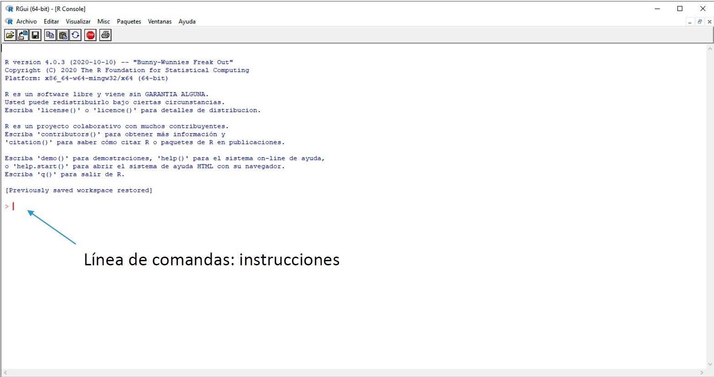
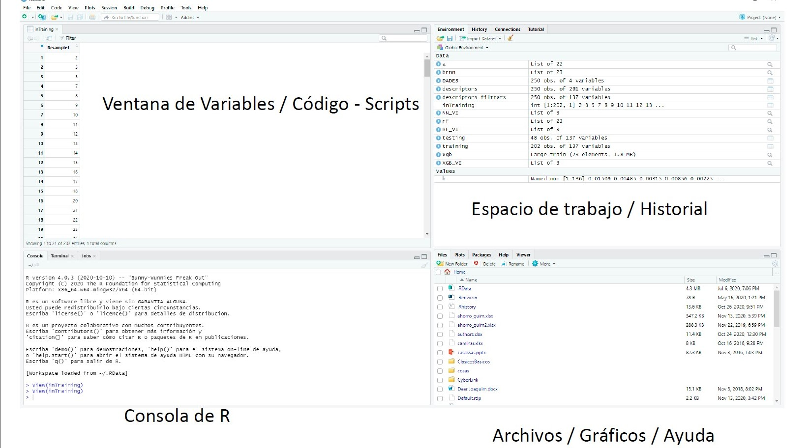

---


J.D. Long

## Por qué aprender R?

- Nos conecta con una comunidad genial.
- La programación es un super poder al cual todos tenemos acceso.
- Podemos limpiar, analizar, graficar y comunicarnos con nuestros datos, todo en un solo sitio.
- Automatización.
- Es gratis! 


## Introducción: R

**R** es un entorno de programación **libre** y **multiplataforma** para cálculos **estadísticos** y representaciones **gráficas**

Desarrollado por Ross Ihaka y Robert Gentleman a principios de los 90 en la Universidad de Auckland, Nueva Zelanda


Más adelante, paso a ser parte del proyecto GNU soportado por la Fundación para la computación estadística (FSC) y ha incrementado su popularidad.

Página web del proyecto: [https://www.r-project.org](https://www.r-project.org)

## Introducción: R

La consola de R



## Introducción: RStudio

**R Studio** es un entorno de desarrollo integrado (IDE) de código abierto para el lenguaje de programación R.

Facilita el trabajo con R (no es imprescindible), incluye:

* Consola
* Editor de textos
* Herramientas para el trazado, la depuración y gestión del espacio de trabajo.

Página web: [https://www.rstudio.com](https://www.rstudio.com)


## Introducción: RStudio

La ventana de trabajo proporciona mucha mas información:



## Introducción al trabajo con R

**Propiedades de una sesión de trabajo**


R guarda el 'espacio de trabajo' (workspace/environment) en el 'directorio de trabajo'

Para saber lo que hay en el workspace: `ls()`


## Introducción al trabajo con R

**Primeras operaciones con R: operaciones básicas**

Se pueden ejecutar tanto en la linea de comandos como en la ventana de scripts

```{r}
34 + 4
```
Ventana de scripts: escribir la instrucción y *Run* (Ctrl + Enter)


---

**Asignación** (dar un valor a una variable)

```{r}
X <- 6
```

da a `x` el valor de 6

```{r}
y <- c(1,2,3)
```

da a `y` el valor de un vector formado por los numeros 1, 2 y 3

Si preguntamos el valor de `y`: 

```{r}
y
```


---

R contiene una serie (grande) de funciones que permiten realizar de forma simple operaciones básicas

Considerando la `y` definida anteriormente:

```{r}
sum(y)
```

Suma los elementos de `y`


```{r}
mean(y)
```

calcula la media de los elementos de `y`

---

También se puede asignar a una nueva variable

```{r}
y_mean <- mean(y)
y_mean
```

**Ayuda (help) de funciones**

Menús desplegables predictivos que permiten elegir opciones de nombres (o variables) para que sea más intuitivo

---

**Primeras operaciones con R: funciones basicas**

Sintaxis:

```{r eval=FALSE}
nombre_de_la_funcion()
```

Nombre y parentesis **siempre**

```{r eval=FALSE}
nombre_de_la_funcion(argumentos)
nombre_de_la_funcion(arg1, arg2, arg3,...)
```

Aconstumbran a tener un número variable de argumentos.


---

Si se llama a los argumentos:

```{r eval=FALSE}
funcion(6,3,1)
```

Implica que arg1 = 6, arg2 = 3, arg3 = 1 lo que se llama 'referencia posicional'


Si se llama a los argumentos:

```{r eval=FALSE}
funcion(6,arg3 =1,arg2 = 3)
```

define argumentos sin tener en cuenta el orden 'referencia por claves'


---

Ademas, R permite al usuario crear fácilmente funciones propias

```{r eval=FALSE}
miFuncion <- function(){
  
  ordenes
  return(variable)
}
```

---


por ejemplo, multiplicar dos valores

```{r}
multiplica <- function(x,y){
  
  z <- x*y
  return(z)
  
}
```
```{r}
multiplica(2,3)
```

---


**Primeras operaciones con R**

No siempre los datos que analizamos son completos

En R, estos valores se representan con el codigo **NA** (*not available*)

```{r}
z <- c(4,12,14,NA,11)
```

```{r}
z
```

---

Poblema: Pueden las funciones trabajar con estos valores? (probar sum o mean)

```{r}
mean(z)
```

Un parámetro (argumento) de las funciones para no tener en cuenta los NA:

```{r}
mean(z, na.rm = TRUE)
```


---

Identificación de valores: `is.na()`

```{r}
is.na(z)
```

---

**Estructuras de R**

*Vector*

Conjunto de elementos (componentes) de datos del mismo tipo

Números:

```{r}
x <- c(1,2,3)
```

```{r}
x <- c(x,4)
```

```{r}
x
```


---

texto: ciudades

```{r}
ciudades <- c('Salento', 'Mariquita', 'Frankfurt')
```

Lógico

```{r}
y <- c(TRUE,FALSE,TRUE)
```


Acceso a elementos (entre corchetes []): ciudades[1]

```{r}
ciudades[1]
```


---

**Vectores Numéricos**

Existen funciones especiales para la creación de vectores numéricos:

*secuencia* : 

```{r, eval=FALSE}
seq(valor inicial, valor final, intervalo)
```

```{r}
z1 <- seq(1,25)
```

```{r}
z1
```

---


```{r}
z2 <- seq(5, 50, 5)
```

```{r}
z2
```

Alternativa si se va de uno en uno:

```{r}
z1 <- 1:25
```

```{r}
z1
```

---

Repetición

```{r eval = FALSE}
rep(vector, numero de repeticiones)
```

```{r}
x1 <- 1:5
rep(x1,3)
```

---

**Matrices**

tabla 2D de elementos del mismo tipo 

Creación de matrices: primero un vector con el contenido

```{r}
xmat <- seq(1,20)
dim(xmat) <- c(5,4)
xmat
```


---

Trasposición

```{r}
xmat
```

```{r}
t(xmat)
```


---

**Listas**

Una lista es una coleccion de objetos, y cada uno de ellos puede ser de diferente tipo o clase

```{r}
lista1 <- list(1, c(1,2,3), 'hola')
```

```{r}
lista1
```

---


Acceso a los elementos con doble corchete:

```{r}
lista1[[1]]
```


Lista con nombre de los elementos:

```{r}
lista1b <- list('num' = 1, 'vector' = c(1,2,3), 'texto' = 'hola')
```

Acceso a los elementos con `$nombre`
```{r}
lista1b$vector
```

---

¿Importancia de las listas?

Muchas de las funciones estadísticas con las que trabajaremos proporcionan su salida en forma de lista.