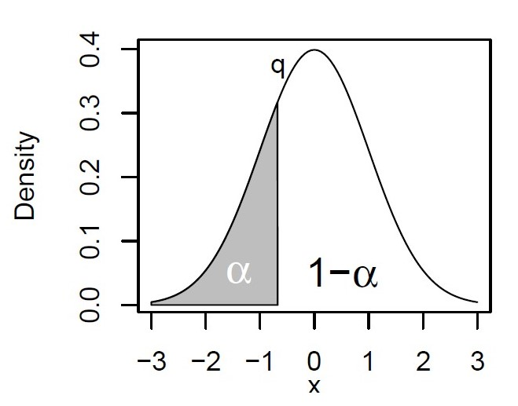
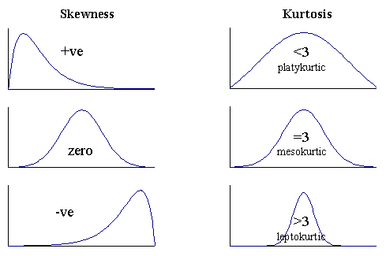
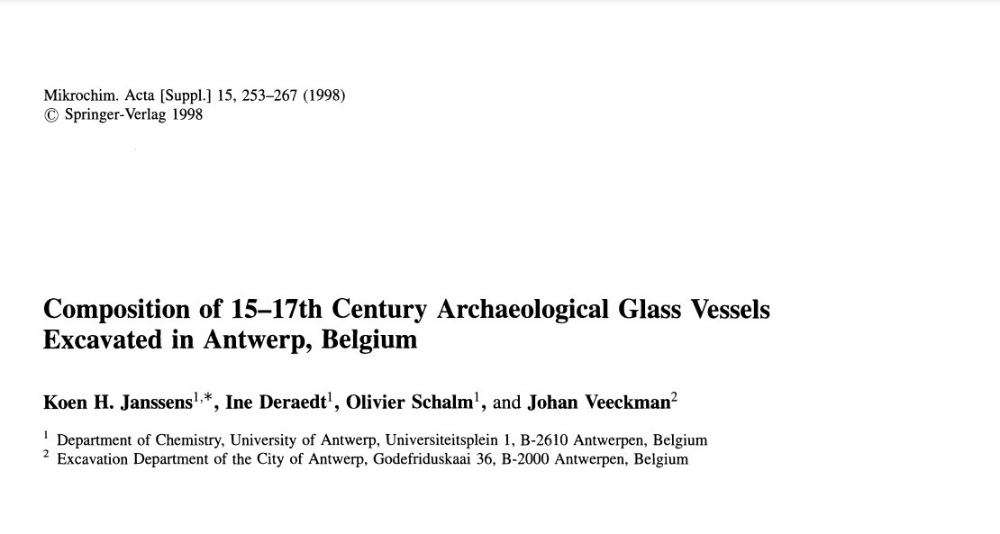

# Distribuciones

>- La cantidad de datos suele ser pequeña (cantidad de muestra, costo).
>- La naturaleza de la distribución suele desconocerse.
>- Cuando hacemos un experimento, determinamos una propiedad **x** de un sistema. Los valores que toma esta propiedad tienen una **distribución empírica**.

>- <p style="color:blue;">
Siempre que sea posible, debemos inspeccionar visualmente esta distribucion para tener una mejor idea de la estructura de los datos. </p>

## Medidas descriptivas de una distribucion:

>- minimo
>- promedio
>- mediana
>- maximo
>- **cuantiles**

## Cuantiles

Un cuantil *q* se define para una fraccion $\alpha$ (entre 0 y 1). Es el valor cuando una fraccion $\alpha$ de los datos es menor a este valor, y una fraccion $1 - \alpha$ es mayor a este valor.



## Cuantiles

Para los **percentiles**, $\alpha$ se expresa en porcentaje (%).


---

## Cuartiles 

Los **cuartiles** dividen la distribucion en cuatro partes:

>- Primer cuartil **($Q_1$)** : 25%
>- segundo cuartil **($Q_2$)** : 50% = mediana
>- Tercer cuartil  **($Q_3$)** : 75% 


---

Es posible calcular los cuartiles para un set de datos:

```{r }
x <-  c(47,52,52,57,58,58,60,65,66,66,71,71,72,73,96)
x
```

Ejercicio 1

---


La funcion `quantile()` de `R` nos da informacion sobre estas medidas descriptivas

```{r}
x <-  c(47,52,52,57,58,58,60,65,66,66,71,71,72,73,96)
quantile(x, type = 2)
```

Existen varios [métodos](https://en.m.wikipedia.org/wiki/Quartile) para calcular los cuartiles.

---

```{r, out.width= '65%'}
boxplot(x)
abline(h = c(36,92), lty = 2)
```


---


## Curtosis y oblicuidad en R

son medidas de la desviacion de la normalidad para una distribucion:

>- curtosis para $N(\mu,\sigma)$: 3

>- oblicuidad para  $N(\mu,\sigma)$ : 0



---


## Curtosis y oblicuidad en R


```{r}
library(moments)
kurtosis(x)
skewness(x)
```

Existen varias definiciones para cada estimador.


---


Para nuestra distribucion: curtosis de 4.43 y oblicuidad de 1.04 

```{r, out.width= '60%'}
plot(density(x))
```

---

Quitando el valor atipico:

```{r, , out.width= '60%'}
plot(density(x[-15]))
```

---

Si calculamos los estimadores sin el valor atipico:

```{r}
kurtosis(x[-15])
skewness(x[-15])
```


---


Ademas, existe una serie de graficos para  evaluar visualmente la **distribución empírica** de un experimento.



---

```{r  message = FALSE, out.width="65%"}
library(chemometrics) #Donde estan los datos
data(glass) #Cargamos los datos del vidrio
CaO <- glass[, 'CaO']# Seleccionamos los resultados de CaO
CaO # 180 mediciones
```
---

```{r  message = FALSE, out.width="65%"}
stripchart(CaO, method = 'jitter') # diagrama de dispersion 1-D 

```

---

```{r  message = FALSE, out.width="65%"}
hist(CaO) # Histograma 

```


---

```{r  message = FALSE, out.width="65%"}
plot(density(CaO),
     main = 'diagrama de densidad para % de CaO',
     xlab= '% CaO') 

```


## Diagrama de cajas y bigotes (boxplot)

```{r  message = FALSE, out.width="65%"}
boxplot(CaO)

```


## boxplot por grupos

```{r  message = FALSE, out.width="55%"}

data(glass.grp)
boxplot(CaO ~ glass.grp)

```


---

Ejercicio 2


```{r}
library(downloader)
url="https://raw.githubusercontent.com/genomicsclass/dagdata/master/inst/extdata/msleep_ggplot2.csv"
filename <- basename(url)
download(url,filename)

```


```{r , message = FALSE}
library(readr)
msleep_ggplot2 <- read_csv("msleep_ggplot2.csv")
```

>- Calcular los cuartiles para la variable `sleep_total` del data.frame
>- Evaluar visualmente la distribucion mediante las funciones `stripchart()`, `hist()`, `plot(density())` y `boxplot()`


---

```{r , out.width="65%"}
library(ggplot2)
# Basic box plot
p <- ggplot(msleep_ggplot2, aes(x=vore, y=sleep_total)) + 
  geom_boxplot()
p
```


